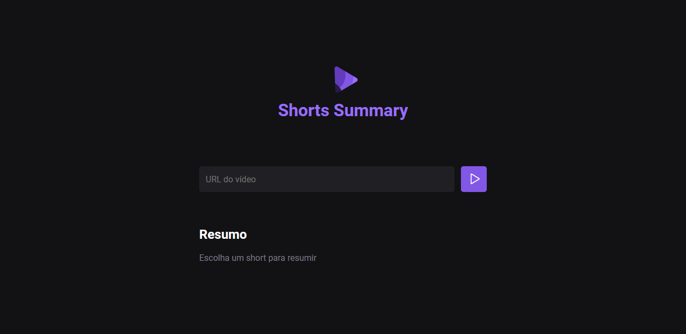

<h1 align="center"> Shorts Summary </h1>

O Shorts Summary é uma aplicação desenvolvida durante o evento NLW 13:IA da RocketSeat. 

  <a href="#-tecnologias">Tecnologias</a>&nbsp;&nbsp;&nbsp;|&nbsp;&nbsp;&nbsp;
  <a href="#-layout">Layout</a>&nbsp;&nbsp;&nbsp;|&nbsp;&nbsp;&nbsp;
  <a href="#memo-licença">Licença</a>

  

 

  

## 🖥️ Projeto

A aplicação Shorts Summary, consiste em utilizar ferramentas de Inteligência Artificial, para buscar por shorts do YouTube e fazer um resumo desse vídeo.

## 🚀 Tecnologias

Esse projeto foi desenvolvido com as seguintes tecnologias:

- HTML e CSS
- JavaScript
- NodeJs
- Whisper (Modelo da OpenAi de reconhecimento automático de fala)
- Bart (Modelo da OpenAI para resumo de texto)
- Git e GitHub
- Figma

## 🔖 Layout

Você pode visualizar o layout do projeto através [DESSE LINK](<https://www.figma.com/file/lFdQs8MfFeZLtbgFzJcpSu/Shorts-Summary-%E2%80%A2-Trilha-Foundations-(Community)?type=design&t=bXeB2BzZ0si08lfC-6>). É necessário ter conta no [Figma](https://figma.com) para acessá-lo.

## :memo: Licença

Esse projeto está sob a licença MIT.

---

Feito com ♥ by Rocketseat :wave: [Participe da nossa comunidade!](https://discord.gg/rocketseat)
